# Artefact

<p align="center">
    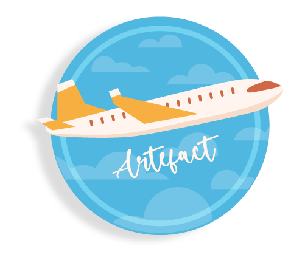
<br><br>
A hand crafted immersive treasure hunt game mixed with thrill, surprise and adventure around every corner.
Fly High and Dive Deep
Based on Avaition theme, trivia, puzzlues, and your chance to be a wing master. 
</p>
<br>

## Table of Contents
<!-- <> -->
* [Game Features](#game-features)
* [Flow Chart Markdown](#flow-chart-markdown)
* [Player and Analytics](#player-and-analytics)
* [Authentication](#authentication)
* [Authorization and Security](#authorization-and-security)
* [Screen Shots](#screen-shots)
* [Structure of the game](#structure-of-the-game)
* [General Instructions for the game](#general-instructions-for-the-game-are-as-follows)
* [Stage 1: Ready for Takeoff](#stage-1-ready-for-takeoff)
* [Stage 2: Save the Souls](#stage-2-save-the-souls)
* [Stage 3: The Numble Game](#stage-3-the-numble-game)
* [Stage 4: The lost Artefact](#stage-4-the-lost-artefact)
* [Stage 5: The Flying Enigma](#stage-5-the-flying-enigma)
* [Wing Master Badge](#wing-master-badge)
* [Tech stack](#tech-stack)
* [Project Set-up](#project-set-up)
* [Credits](#credits)
<!-- <> -->

## Game Features

- [x] 5 stages of game
    1. Ready for Takeoff
    2. Save the Souls
    3. The Numble Game
    4. The lost Artefact
    5. The Flying Enigma
- [x] Soft skills assessed
    1. Critical Thinking
    2. Decision Making
    3. Patience
    4. Problem Solving
    5. Eye for Detail
    6. Logical reasoning
    7. Lateral Thinking
    8. Auditory
<!--     <p align="left"> -->
- [x] Dead Ends
    1. First on stage 2:  Save the Souls
    2. Second on stage 3:  The Numble Game
<br>

## Flow Chart Markdown
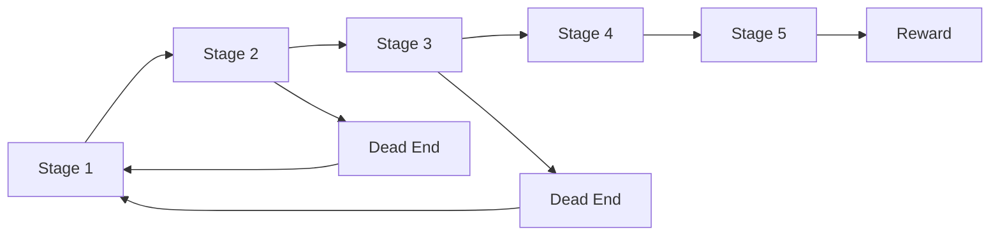

### Player, Analytics and Insights
- User leader board
- Admin Panel
- Player Analytics and Reward after user finish all levels.
- Overall and  each Player's analytics in admin panel
- Palyers can't skip level by changing web adress.
- Saving user state and level after each stage in databse.

## Authentication 
- [x] Sign in with Google (Oauth) [recommended for better user experience]
- [x] User Sign up
- [x] User Sign in
- [x] admin login

## Authorization and Security

Only logged in users can:
- [x] Play game
- [x] Access player analysis
- [x] Only admin can access Admin Panel

# Screen Shots

<p align="left">
        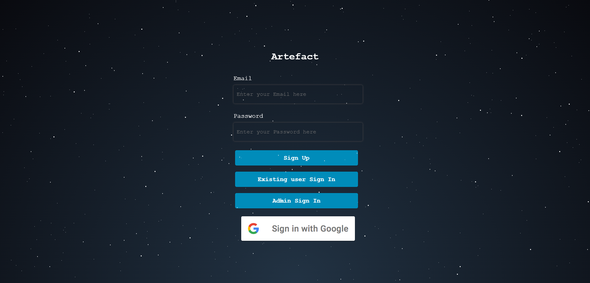
        <br>
        Sign Up Page<hr>
        <br><br>
        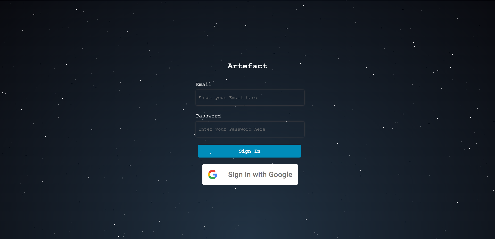
        <br>
        Login Page<hr>
        <br><br>
        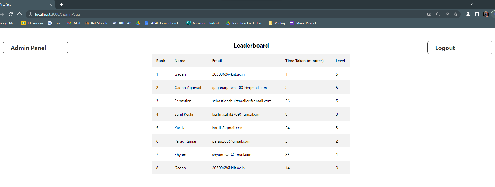
        <br>
        Admin Panel and LeaderBoard<hr>
        <br><br>
        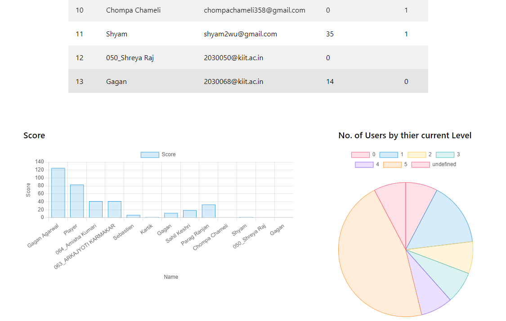
        <br>
        Player Analytics Graph<hr>
        <br><br>
        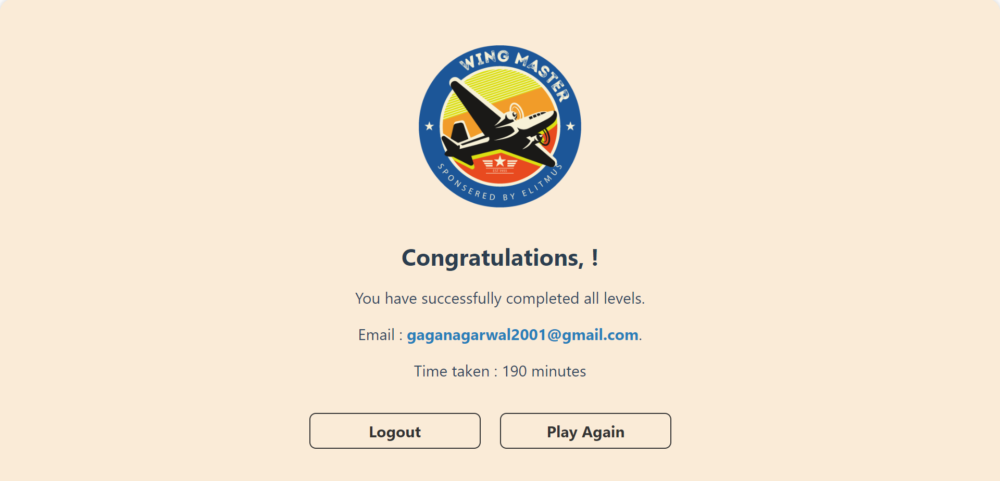
        <br>
        Wing Master Certificate<hr>
</p>


# Structure of the game

- The game has develoved to asses user's soft skill while providing an immersive experience.  


## General Instructions for the game are as follows:

- I recommended to sign in with google for a better user experience.

- I recommend completing all stages in one session, as scores are populated on levels and time taken. 

- Stages are incremented and Time Taken is saved in the daatabse.

- You can always start where you left off.

- Read the instructions on each levels carefully as they are clues to take you forward.

- If you hit a deadend, you can always choose to play again.

# Stage 1: Ready for Takeoff
<hr>
<p align="center">
        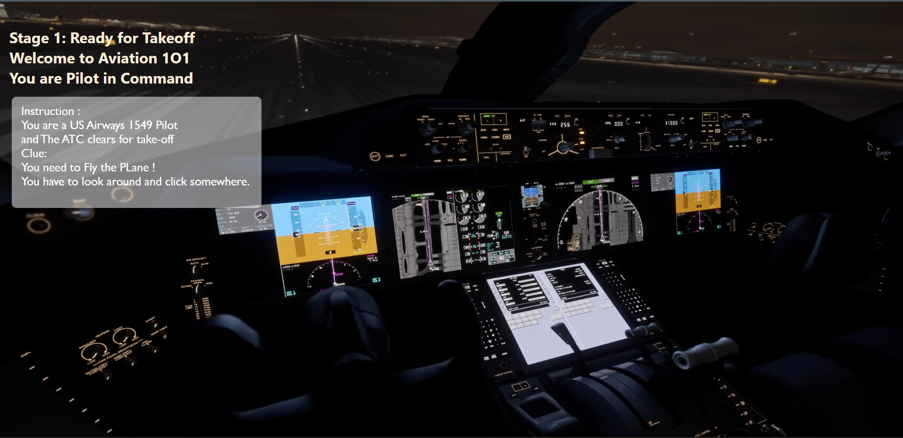
    </p>


## Soft skills tested: 

- Critical Thinking
- Eye For Detail

## Dead end: 0

## Clues: 

    - The image showcase a cockpit view and you are the pilot in command.


## Story
```
You are a US Airways Flight 1549 pilot, and ATC clears for takeoff.
```

## Puzzle

The Image of a cockpit and the player has to use his critical thinking skills and fly the pkane.

## Solution

<details> 
  <summary> Click to view ? </summary>
  Click on The Throttle
</details>

## Motive

This stage aims to give players a head start and take them on a thrilling journey of treasure hunting.  

<br>

# Stage 2: Save the Souls
<hr>
<p align="center">
        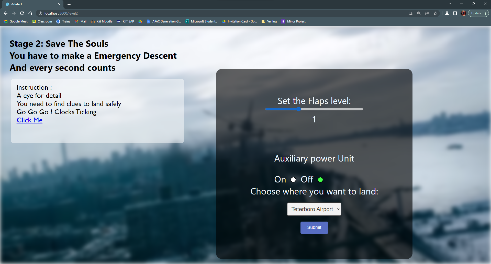
    </p>

## Soft skills tested: 

- Decision Making
- Eye for Detail
- Problem Solving
- Memory


## Clues: 

You are given a extrnal link, you need to look to clues in the video.

## Story
```
You lost your Engines Mid flight, and the plane is losing altitude with 155 onboard, you are captain flying.  
```

## Puzzle

Set the Flaps Level, choose the APU state and choose where to land, clocks tickin' !

## Dead end: 1

- If the player choose a different answer, the plane suffer a fatal crash, Hence Deadend.

## Solution

<details> 
  <summary> Click to see? </summary>
  Set Flaps: 2, APU: on, Land : Hudson River  
</details>

## Motive

This stage is design to assess memory and decision making skills.

<br>

# Stage 3: The Numble Game
<hr>
<p align="center">
        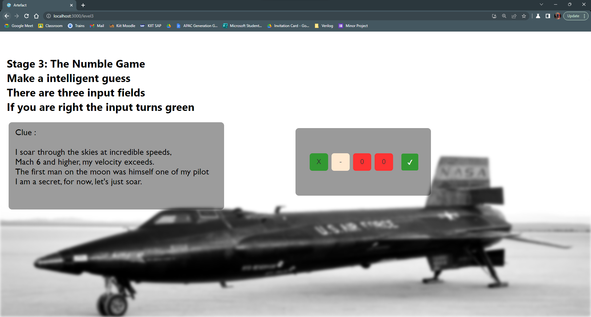
    </p>

## Soft skills tested:

- Logical Reasoning
- Lateral Thinking


## Clues: 
- You are given a riddle and you can also make intelligent guess, if you are right the input fields are green.

## Story

```
It's a plane a relic of the past, faster than sound, somehow related to the first man on the moon. 
```

## Puzzle

Solve the Numble Puzzle based on the clue and intellingent guess.

## Dead end: 1

There are multiple answer incorporated in this level, if the player answers otherwise, leads to a deadend.

## Solution
<details> 
  <summary> Click to see? </summary>
            X-15 
</details>

## Motive
The stage tests user of thier knowledge of niche things and asses the logical comprehension. 


# Stage 4: The lost Artefact
<hr>
<p align="center">
        
    </p>

## Soft skills tested: 
- Coprehension
- Auditory 

## Clues: 
    The audio is your clue.
    
## Story

```
The lost Artefact, the plane that was never found, the greatest mystery of all times. 
```

## Puzzle
    You need to listen to the audio and answer correctly.

## Solution
<details> 
  <summary> Click to see? </summary>
  MH370  
</details>

## Motive

The satge is to test user compreshension and Auditory Skills.

<br>

# Stage 5: The Flying Enigma
<hr>
<p align="center">
        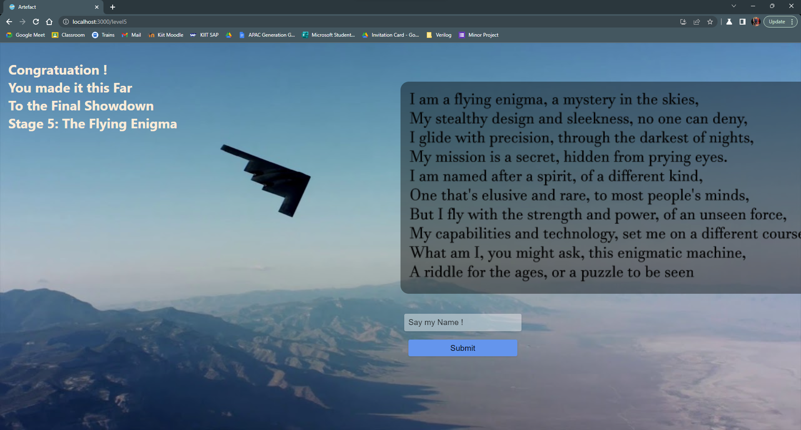
    </p>

## Soft skills tested: 

- Eye for Detail
- Lateral Thinking
- Lateral Thinking


## Clues: 

- As the name suggests "The flying Enima", the picture and riddle is your clue.  

## Story

```
It a behemoth yet stealth, fearing the enemy, and one of the great Enigma.
```

## Puzzle

The final showdown, answer the riddle with full answer to get your reward. 

## Solution

<details> 
  <summary> Click to see? </summary>
 Northrop Grumman B-2 Spirit
</details>

## Motive

The stage test the curiosity of the user and testing player patience to extreme. 

<br>

# Wing Master Badge
<hr>


# Tech Stack:

## Frontend


## Backend


## Database and Authentication


Database Structure Used
<br>


## Hosting 


# Project Set-up
## Install Node
- #### Node installation on Windows

    $ winget install node
<br>
    or go on [official Node.js website](https://nodejs.org/) and download the installer.
    Also, be sure to have `git` available in your PATH.

- #### Node installation on Ubuntu

  You can install nodejs and npm easily with apt install, just run the following commands.

      $ sudo apt install nodejs
      $ sudo apt install npm

## Install Project through CLI

    $ git clone https://github.com/synapse2001/Artefact
    $ cd artefact
    $ npm install

## Configure Project

To set up this project for yourself, you will need to create a project on Firebase and 
replace the credentials at the necessary locations, as this project utilizes Firebase technology.

### Install The dependencies

    $ npm install firebase

    $ npm install -D tailwindcss

    $ npx tailwindcss init

    $ npm install react-icons

    $ npm i node-sass

    $ npm install saas
    
    $ npm install chart.js

<br>

# Credits
- Sully Movie Scene : https://www.youtube.com/watch?v=qHQmkJjwNqs&t=84s
- Netflix : https://www.youtube.com/watch?v=TDg0m2Q3H8c
- Images and Graphics: https://www.freepik.com/


